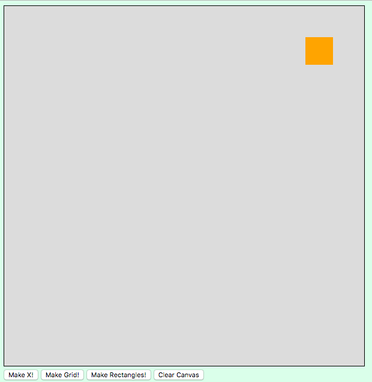

# Canvas Crash Course

**Created by**: Reuben Ayres<br>
**Type**: Workshop/Lesson (long, with activities)<br>
**Prerequisites**: Object Oriented Programming with JavaScript, DOM Manipulation with vanilla JavaScript<br>
**Competencies**: Applying OOP concepts, mathematical & programmatic thinking, Reading and applying documentation


## What is Canvas

Invented by Apple and later implemented in all browsers, **[It's a way to draw graphics manually with JavaScript](https://developer.mozilla.org/en-US/docs/Web/API/Canvas_API)**.  You don't need any libraries or anything like that. Making graphs and apps with canvas isn't exactly Web Development in the sense we mean it in this class, but _it's a great way to practice and apply Object Oriented Programming concepts as well as writing game and application logic_.

If you wanna get real real fancy and do advanced graphics and 3d stuff, you can use the also-built-in [WebGL library](https://developer.mozilla.org/en-US/docs/Web/API/WebGL_API), (or any of several 3rd party libraries such as ThreeJS) but for this lesson we're gonna focus on 2D graphics. 

Note: [The MDN Tutorials](https://developer.mozilla.org/en-US/docs/Web/API/Canvas_API/Tutorial) and documentation linked above are a great way to rigorously learn all the ins and outs of Canvas, if this leaves you wanting more.  In this lesson however, we've just cherry-picked a few of the most useful patterns and techniques to get you building with canvas, using what you know. 

> Another note: Don't confuse the built-in Canvas API with other confusingly similarly named packages, like [https://canvasjs.com/](CanvasJS).  We're not using an external library, everything we're using is built-in.


### Setup

Make a folder structure. We'll pass on jQuery this time, and use VanillaJS for the DOM manipulation and I/O, but you could use jQuery for it if you really wanted to.

## `<canvas>`

To use canvas, you have to literally create a canvas element in the DOM.  We do this with the `<canvas>` tag.  You could make it any size, but avoid using a dynamic size (percentages, for example), because you're going to need to be able to tell where things are in relation to the borders. For this lesson, we'll use a nice medium sized square. 

```html
<canvas id="my-canvas" width="600" height="600"></canvas>
```

You'll note the use of inline styling for the width and height.  **Never use hard-coded HTML attributes for styling** _unless you're using Canvas_, in which case it's ok.

#### A little styling

Let's give our canvas a border and a chill neutral background color so we can see what we're working with. 

```css
canvas {
  border: 1px solid black;
  background-color: rgb(220, 220, 220);
}  
```

### A little more setup

For reasons you can read about [here—rabbit hole alert](https://developer.mozilla.org/en-US/docs/Web/API/RenderingContext), to do graphics we need what's called a `RendingContext`. To do canvas apps, we'll just always use the [`CanvasRenderingContext2D`](https://developer.mozilla.org/en-US/docs/Web/API/CanvasRenderingContext2D) rendering context.  Don't worry, you don't really need to understand this other than "it's a thing you need to do when setting up canvas apps."

```javascript
const canvas = document.getElementById('my-canvas');
console.log(canvas) // cool now we have the canvas

// the "context" is what you actually draw on -- you basically always need it
const ctx = canvas.getContext('2d');
console.log(ctx); // cool, our rendering context is set up
```

Take a second to check out the canvas element ctx objects you logged in the console.  


## Let's Draw!

Pretty much all shape and line drawing you do in canvas, you do using methods attached to the `CanvasRenderingContext2D` object. 

### Let's draw lines!

Probably the most popular ["Hello, World!"](https://en.wikipedia.org/wiki/%22Hello,_World!%22_program)-type exercise of any graphical endeavour is to draw a line.  

#### Location on a `<canvas>`.

In the world of canvas, you will constantly need to understand distances and locations the way canvas does.  Everything is done using `x` and `y` coordinates, **measured from the top left of the canvas**.

So the x value is how far over from the left side, and the y value is how far down from the top.  

In our example:
- the top left is (0, 0)
- the top right is (600, 0), or more appropriately: `(canvas.width, 0)`
- the bottom right is at (600, 600), better expressed as: `(canvas.width, canvas.height)`.
- the bottom left is at (0, 600), but use `(0, canvas.height)` to be more _programmatic_ and less hard-coded.


#### Steps to draw a line:

* politely tell canvas we're starting a new line (we're actually technically making a "path", which is where the line _will_ go) using [`beginPath()`](https://developer.mozilla.org/en-US/docs/Web/API/CanvasRenderingContext2D/beginPath)
* indicate the start of the line/(path) with [`moveTo()`](https://developer.mozilla.org/en-US/docs/Web/API/CanvasRenderingContext2D/moveTo)
* indicate the end of (this part of) the path with [`lineTo()`](https://developer.mozilla.org/en-US/docs/Web/API/CanvasRenderingContext2D/lineTo)
* actually do the drawing of the path with [`stroke`](https://developer.mozilla.org/en-US/docs/Web/API/CanvasRenderingContext2D/stroke)—the **stroke** is what you actually see.

```js
// "hey i'm about to draw a new line"
ctx.beginPath()

// "start the line here"
ctx.moveTo(100, 100) // pass in coords starting from top left corner: x, then y.

// "the line should end here"
ctx.lineTo(300, 300)

// "actually draw the line"
ctx.stroke();
```

Now reload your page, and see that you now have a line!!


#### Styling a stroke

If you happen not to want to draw a 1px-wide black line, you could change the `strokeStyle` and/or `lineWidth` properties...

Add these between the `.lineTo()` and `.stroke()` statements in your code
```js
// style your stroke -- any valid CSS color value can go here
ctx.strokeStyle = "blue";

// this will "stick" until you change it 
ctx.lineWidth = 6
```
... and you'll have a thicker blue line.

#### :large_blue_circle: Activity: Draw another line to make an X

See if you can finish the "X"!  If you used my colors/widths, it should look like this:


#### Solution:
Click the arrow to see:
<details>

Add the following:
```js
ctx.beginPath();
ctx.moveTo(100, 300);
ctx.lineTo(300, 100);
ctx.stroke();
```
Note that the `strokeStyle` and `lineWidth` were preserved.  Remember that, in case you ever wanna change the type of line you're drawing.
</details>


---

### Keep being modular.

Let's put all the code we've written that makes an X in a function, called `makeX`.

```js
function makeX() {

  // "hey i'm about to draw a new line"
  ctx.beginPath()

  // "start the line here"
  ctx.moveTo(100, 100) // pass in coords starting from top left corner: x, then y.

  // "the line should end here"
  ctx.lineTo(300, 300)

  // you could style your stroke -- any valid CSS color value can go here
  ctx.strokeStyle = "blue";

  // this will "stick" until you change it 
  ctx.lineWidth = 6

  // "actually draw the line"
  ctx.stroke();

  ctx.beginPath();
  ctx.moveTo(100, 300);
  ctx.lineTo(300, 100);
  ctx.stroke();
  
}

makeX();
```

There. That's better.


#### :large_blue_circle: Activity: make a function that draws a grid

Write a function called `drawGrid()` that draws a grid of 1px black lines with 49px between them i.e. horizontal and vertical lines every 50px.

> Hint: use `for` loop(s)

Let's also remember that we're ultimately gonna be using canvas in web apps, not just drawing things in a vacuum. So, also make a button that calls your grid function, and one that calls your X function.  (And remove the call to `makeX()` in the global scope.)


**What you should see when you click the "Make Grid" button**


#### Bonus: 

Make `makeGrid()` take a parameter `size`, and have the squares be that size instead of 50 (well, ok, 49) pixels.

#### Solution -- Click to see
<details>

```js
// makes a grid of 1px black lines with 49px between each parallel line
function makeGrid() {
  ctx.strokeStyle = "black";
  ctx.lineWidth = 1

  // draw vertical lines
  for(let i = 0; i <= canvas.width; i += 50) {
      ctx.beginPath();
      ctx.moveTo(i, 0);
      ctx.lineTo(i, canvas.height);
      ctx.stroke();
  }
  // draw horizontal lines
  for(let i = 0; i <= canvas.height; i += 50) {
      ctx.beginPath();
      ctx.moveTo(0, i);
      ctx.lineTo(canvas.width, i);
      ctx.stroke();
  }

}

document.getElementById('make-x').addEventListener('click', (event) => {
  makeX();
})
document.getElementById('make-grid').addEventListener('click', (event) => {
  makeGrid();
})
```

</details>


## Drawing shapes

Well, we might want to draw more than just lines.  

### Rectangles

Drawing a rectangle is similar to drawing a line; only slightly more complex.  Instead of `moveTo` and `lineTo`, we use [`.rect()`](https://developer.mozilla.org/en-US/docs/Web/API/CanvasRenderingContext2D/rect). It takes parameters for the coordinates of the top left corner, the height, and the width. Take a look at the comments in the code below for more details.  Read 'em twice.

### Drawing outlines of a rectangle (stroking a path)

Note that we are still just making a rectangular "path," and we must still "stroke" to actually see it.  

```js
// let's make a rectangle (outline)!

// same as before....
ctx.beginPath();

// this is the method for rectangles of any shape
// it takes 4 parameters, here they are in order
// 1. x coord of the UPPER LEFT HAND CORNER of the rectangle
// 2. y coord of the UPPER LEFT HAND CORNER of the rectangle
// 3. width of rect
// 4. height of rect
ctx.rect(300, 300, 80, 180);

// set styles
ctx.strokeStyle = "maroon";
ctx.lineWidth = 4;

// actually draw the outline of the rectangular path
ctx.stroke();
```

You should see something like this:<br>


Cool!

### Drawing a solid rectangle (filling a path)

If you wanted the rectangle to be solid and filled in instead of just an outline, you could "fill" it, like so;

```js
// let's make a rectangle (filled in)!

ctx.beginPath();
ctx.rect(70, 200, 280, 80);

// here's how we set the fill color 
ctx.fillStyle = "brown";

// use fill instead of stroke if you want your shape filled in
ctx.fill()
```

You should now see something like this:<br>


Double cool!


## Keep it clean.

Again, let's not get carried away with cluttering up the global scope.  Let's put our rectangle drawing codes in a function, and add another button in the html that will call it, and another listener/handler at the bottom that will wire up our button to work correctly;

Our rectangles function:
```js
function makeRectangles() {

  // make a rectangle outline -------

  // same as before....
  ctx.beginPath();

  // this is the method for rectangles of any shape
  // it takes 4 parameters, here they are in order
  // 1. x coord of the UPPER LEFT HAND CORNER of the rectangle
  // 2. y coord of the UPPER LEFT HAND CORNER of the rectangle
  // 3. width of rect
  // 4. height of rect
  ctx.rect(300, 300, 80, 180);

  // set styles
  ctx.strokeStyle = "maroon";
  ctx.lineWidth = 4;

  // actually draw an outline of a rectangle
  ctx.stroke();


  // Make a rectangle (filled in)! -------

  ctx.beginPath();
  ctx.rect(70, 120, 170, 40);

  // set the fill color 
  ctx.fillStyle = "green";

  // use fill instead of stroke to get shape filled in
  ctx.fill()
}
```

Our buttons:
```html
  <button id="make-x">Make X!</button>
  <button id="make-grid">Make Grid!</button>
  <button id="make-rect">Make Rectangles!</button>
```

Our listeners and handlers so far, at the bottom of our `app.js`:
```js
document.getElementById('make-x').addEventListener('click', (event) => {
  makeX();
})
document.getElementById('make-grid').addEventListener('click', (event) => {
  makeGrid();
})
document.getElementById('make-rect').addEventListener('click', (event) => {
  makeRectangles();
})
```

## Erasing the canvas

You can erase the entire canvas, or a portion of it, using the [`clearRect()`](https://developer.mozilla.org/en-US/docs/Web/API/CanvasRenderingContext2D/clearRect) method.  You don't need to do any "begin path" or anything else, a simple call to clearRect will do the trick.  Note that, like `.rect()`, `.clearRect()` takes the same 4 parameters: upper left x, upper left y, width to clear, and height to clear.

#### :large_blue_circle: Activity: Make a button that clears the canvas.

Let's just skip the global scope stuff. Try making a function that clears the entire canvas, and a button that calls that function.  Test your function by drawing things by pressing the other buttons, then pressing your clear button. When you're done it should clear the entire canvas, but take a minute to play around with passing different values to `.clearRect()`, and note how you could change them to have only part of the canvas get erased.

Solution: click to see:

<details>

```js
function clearCanvas() {
  ctx.clearRect(0, 0, canvas.width, canvas.height)
}

//.... and at the bottom of the file:
document.getElementById('clear').addEventListener('click', (event) => {
  clearCanvas();
})
```

```html
<button id="clear">Clear Canvas</button>
```
</details>


## Being "Object-oriented" with Canvas

Now that you have different buttons that cause different things to be painted, play around with clicking the different buttons, and notice how each thing is drawn into the space regardless of what was there before.  For example, if you Make Grid and then Make X, the X will appear to be "on top of" the grid.  That's because **nothing you see there is real**.  There's no data that backs up anything. The computer is following instructions to paint shapes, and so things are getting painted where you tell it to paint them, regardless of what was there previously.  But **nothing substantive is actually "there", it's just paint on a wall**.

If we want to create things that can be used in a game, we need some _data structures_.

Let's create...

### A square object that has properties and methods 

#### :large_blue_circle: Activity: Make a square object that has a location and can draw itself. 

You'll need location and size properties (the ones demanded by `.rect()`), and a `.draw()` method.  Call to the `.draw()` method from the global scope (for now).

One possible solution—Click to see:

<details>

```js
const captSquare = {
  x: 502,
  y: 52,
  height: 46,
  width: 46,
  color: "orange"
  draw() {
    ctx.beginPath();
    ctx.rect(this.x, this.y, this.width, this.height);
    ctx.fillStyle = this.color;
    ctx.fill();
  }
}

captSquare.draw();
```

Produces this:<br>




</details>


## Drawing circles ("arcs")

Drawing circles is done using the [`.arc()` method](), which works a little differently than `.rect()`.  Circles don't have corners, so instead of specifying the top-left corner, you specify:
- the x and y of the center of the circle, 
- the radius, 
- and some parameters that indicate how much of the circle you want to draw in radians.  

Here's an example, following our pattern of creating a function and a button that calls it. Read the notes in the comments carefully. Note that similarly to rectangles and lines, you could "stroke" a circle instead of filling it.


```js
// let's make a (function that draws a) circle!

function makeCircles() {

  ctx.beginPath();

  // to draw a circle, use .arc() -- params are of a different nature
  // x: the x coord fo the CENTER of the circle
  // y: the y coord of the CENTER of the circle
  // radius: 
  // start: "start angle", we'll keep it simple and just always set this to zero
  // end: "end angle": how much of the circle you want to actually draw in RADIANS (Note 2π radians is 360°), starting from start angle.

  // for simplicity, to draw circles, just always use 0 for start, and 2π (2 * Math.PI) for end.

  ctx.arc(75, 525, 71, 0, Math.PI * 2);

  ctx.fillStyle = '#ff0000';

  ctx.fill();


  // make an olive-green circle outline
  ctx.beginPath();
  ctx.arc(75, 325, 71, 0, Math.PI * 2);

  ctx.strokeStyle = '#999900';

  ctx.stroke();

}
```

and a button and a listener

```html
  <button id="make-circles">Make Circles!</button>
```

```js
document.getElementById('make-circles').addEventListener('click', (event) => {
  makeCircles();
})
```

Now, when we reload the page and press the Circle button, we see:


#### :large_blue_circle: Activity: Make a circle object that has a location and can draw itself.

> Hint: your object should have properties for the x and y values of the center of the circle, as well as a radius.  And give it a `draw()` method too.  


<details>
  <summary>Click here for a solution</summary>

  ```javascript
  const cmdrCircle = {
    x: 200, 
    y: 40, 
    r: 17,
    draw() {
      ctx.beginPath();
      ctx.arc(this.x, this.y, this.r, 0, 2*Math.PI);
      ctx.fillStyle = "cadetblue";
      ctx.fill();
    }
  }
  cmdrCircle.draw();
  ```
</details>


## Movement

Let's think about what might be required to make this circle move around on the page. We want to be very object-oriented, so we will add a `.move()` method to our object.  

And what does it mean to "move"?  

> => It means that we are changing the x and y values of the circle, and then redrawing it in it's new location.  

### Nothing on the screen is real.  Just a reflection of your data.

Remember, we don't want to think of the circle we see on the screen as an actual thing.  What you see on the screen is just paint on a wall.  The "circle" on the screen does not actually exist; it's just left over from the last time you called a `ctx` draw function.  (Similarly in a jQuery-powered game, you want to update the DOM to reflect your data structures...)

#### :large_blue_circle: Activity: Try to implement an ability of the circle to move.  

>Hint: You will need to listen for a keyboard event and in the handlers, call the `.move()` method of the circle.

<details>
  <summary>Click here for a partial solution (contains some issues that will need to be fixed)</summary>

  ```javascript
    move(direction) {
      if(direction=="ArrowDown") {
        this.y += 1;
      }
      if(direction=="ArrowUp") {
        this.y -= 1;
      }
      if(direction=="ArrowLeft") {
        this.x -= 1;
      }
      if(direction=="ArrowRight") {
        this.x += 1;
      }
      this.draw();
    }
  ```

listener: at the bottom of the page

```javascript
document.addEventListener('keydown', (event) => {
  // console.log(event);
  cmdrCircle.move(event.key)
})
```


</details>


Let's take a look at how our code is working at present.  


Ok, so our solution moves the circle, but the movement is painfully slow, and it leaves a trailer -- you can see every location that the circle occupied in its journey.  Mostly, this probably isn't what we want.  

How can we fix these things? 

## Variable speed and "frames"

Getting rid of the trailer is pretty straight forward—we'll just call our `clearCanvas()` function before we redraw the circle.  Note that this means that the _entire_ canvas will be erased, so if anything should "stay" there, we would have to redraw that too somehow.

And, to make the circle move faster, perhaps we can change the x and y values by something other than 1.  We could create a property called `speed` and use that to change how fast the ball moves.  

Our pseudocode for the movemethod then, might look like this:

```
// update x, y by some speed value, according to which key was pressed
// erase the entire canvas
// redraw the circle (and anything else that should stay on the canvas)
```

And here's our updated circle.  While we're getting rid of hard coded values, why not make the color a property too, in case we want to change it?

```js
const cmdrCircle = {
  x: 200, 
  y: 40, 
  r: 17,
  color: "cadetblue" // now the color can be changed
  speed: 10, // changing this will change how "fast" the ball moves
  draw() {
    ctx.beginPath();
    ctx.arc(this.x, this.y, this.r, 0, 2*Math.PI);
    ctx.fillStyle = this.color; // now the color can be changed
    ctx.fill();
  },
  move(direction) {
    if(direction=="ArrowDown") {
      this.y += this.speed;
    }
    if(direction=="ArrowUp") {
      this.y -= this.speed;
    }
    if(direction=="ArrowLeft") {
      this.x -= this.speed;
    }
    if(direction=="ArrowRight") {
      this.x += this.speed;
    }
    eraseCanvas(); // this should fix our trailer issue
    this.draw();
  }
}
```


Awesome!  So our square goes away, since we're not redrawing it, but that's ok... we'll fix it shortly.  Another nice bonus of this type of movement is that it has that 80s pixelated feel.


## Constraints of motion

To make this resemble a real game more closely, how might we prevent her from going off the edge?

#### :large_blue_circle: Activity: Make it so she can't go off the edge.

>Hint: use if statements and the canvas size in your `.move()` method

<details>
  <summary>
    Click here for a solution
  </summary>

```js

```

</details>

...so when we're working with canvas we _often_ need to think mathematically and geometrically to "determine where something is."  Also notice we're referencing the size of the canvas element as opposed to a hard-coded "600."


## Animation frame

There's another way to move things around the screen, that requires us to change how we're thinking about things a little bit.  It's a built in function called [`window.requestAnimationFrame()`](https://developer.mozilla.org/en-US/docs/Web/API/window/requestAnimationFrame).  It is _not_ part of canvas specifically, but it is _very_ frequently used to do movement with canvas apps.  

Here's the anatomy of it:

```js
let x = 0;
function animate() {
  // code in here will be repeated 60 times/sec (approx)

  // do stuff
  console.log(++x);

  // recursion -- you are creating a situation where the function calls itself 
  window.requestAnimationFrame(animate)
}
```

Let's demonstrate the basics of it with captain square.  We'll start by just making him move down.

Update captain square to add the following method:

```javascript
  move() {
    this.y += 5;
  }
```

And let's call it within our animation frame:

```js
function animate() {
  // code in here will be repeated 60 times/sec (approx)

  // do stuff
  console.log(++x);
  
  captainSquare.move();
  clearCanvas(); // prevent trailers!
  captainSquare.draw();

  // recursion -- you are creating a situation where the function calls itself 
  window.requestAnimationFrame(animate)
```

For fun, we'll make a button to start this animation.


### Remember—you must redraw _everything_

Cool!  But our circle is gone now.  Easily fixed -- just have it be re-drawn in the animation frame.  So again, remember: **if you want something to "stay" on the canvas, you must redraw it after each time you erase the canvas**.  It might seem like a lot of work to a human, always completely erasing and redrawing everything, but don't worry, it's a normal way to design a game in canvas.

Note: we also gave `captSquare` a `speed` property.

## Use animation frame to power movement

Let's implement a different type of movement, based on animation frame, for captSquare.  He can be controlled with the w, a, s, and d keys, like back in the day!  For simplicity, we'll make it so that he's always "moving", and, and pressing keys will just change the direction.

Here's our new updated `captSquare`:
```js
const captSquare = {
  x: 502,
  y: 52,
  height: 46,
  width: 46,
  color: "orange",
  speed: 2,

  // added this to keep track of which direction he's moving
  direction: null, 
  
  draw() {
    ctx.beginPath();
    ctx.rect(this.x, this.y, this.width, this.height);
    ctx.fillStyle = this.color;
    ctx.fill();
  },

  // added this to change the direction of movement based on keypress
  // note: the keypress is no longer what actually causes the movement
  setDirection(key) {
    console.log(key);
    switch (key) {
      case 'w':
        this.direction = "up"
        break;
      case 'a':
        this.direction = "left"
        break;
      case 'd':
        this.direction = "right"
        break;
      case 's':
        this.direction = "down"
        break;
    }
  },
  // however our move method *is* still what does the moving
  move() {
    switch (this.direction) {
      case "up":
        this.y -= this.speed;
        break;
      case "right":
        this.x += this.speed;
        break;
      case "down": 
        this.y += this.speed;
        break;
      case "left": 
        this.x -= this.speed;
        break;
    }
  }
}

```

This type of movement would be great for something like Pac Man, once you program the character not to go outside the paths.  


## Stopping the animation-frame based movement 

What would be cool is if we could have the square stop when we released the keys.

Let's keep track of all directions instead of just one in our captain square object, and refactor our code to listen for keyup events, which we will use to "unset" a particular direction, just as we "set" it with keydown.

New event listener for keyup:

```js

document.addEventListener('keyup', (event) => {
  // for captSquare
  if(["w", "a", "s", "d"].includes(event.key)) {
    captSquare.unsetDirection(event.key)  
  }
})

```

Updated `captSquare` object:

```js
const captSquare = {
  x: 502,
  y: 52,
  height: 46,
  width: 46,
  color: "orange",
  speed: 2,
  direction: {
    up: false,
    right: false,
    down: false,
    left: false
  },
  draw() {
    ctx.beginPath();
    ctx.rect(this.x, this.y, this.width, this.height);
    ctx.fillStyle = this.color;
    ctx.fill();
  },
  setDirection(key) {
    // pressing a key means we should be moving in that direction
    // remember -- move will be called every 1/60th of a second regardless
    if(key == "w") this.direction.up = true;
    if(key == "a") this.direction.left = true;
    if(key == "s") this.direction.down = true;
    if(key == "d") this.direction.right = true;
  },
  unsetDirection(key) {
    // releasing a key means we should no longer be moving in that direction
    // remember -- move will be called every 1/60th of a second regardless
    if(key == "w") this.direction.up = false;
    if(key == "a") this.direction.left = false;
    if(key == "s") this.direction.down = false;
    if(key == "d") this.direction.right = false;
  },
  move() {
    // move it if it should be moving
    // remember -- this will be called every 1/60th of a second 
    if(this.direction.up) this.y -= this.speed;
    if(this.direction.right) this.x += this.speed;
    if(this.direction.down) this.y += this.speed;
    if(this.direction.left) this.x -= this.speed;
  }
}
```

Note, for convenience, we've made our animation frame run automatically.


## Stopping the animation

If for some reason you need to stop the animation, it's fairly straightforward, and very similar to stopping a `setInterval`.  Calling [`requestAnimationFrame`](https://developer.mozilla.org/en-US/docs/Web/API/Window/requestAnimationFrame) returns a `requestID` that you can pass into [`cancelAnimationFrame`](https://developer.mozilla.org/en-US/docs/Web/API/Window/cancelAnimationFrame).  

For convenience and good semantics, we'll also use a function `stopAnimation()` to implement this.

And for demonstration purposes, we'll also add a button with a listener/handler to call that function.

```html
  <button id="stop-animation">Stop animation</button>
```

```js
document.getElementById('stop-animation').addEventListener('click', (event) => {
  stopAnimation();
})
```

Updated animation code -- note that we have added a boolean to help us know when animation is running or not.

```js
let requestID;
let animationRunning = false;

let x = 0;
function animate() {
  // code in here will be repeated 60 times/sec (approx)

  animationRunning = true; // this is a flag -- we will use it to prevent running animation more than once
  
  captSquare.move();
  clearCanvas(); // prevent trailers!
  captSquare.draw();

  cmdrCircle.draw(); // that's better

  // recursion -- you are creating a situation where the function calls itself 
  requestID = window.requestAnimationFrame(animate)

}
animate();
```


our stopAnimation function:
```js
const stopAnimation = () => {
  cancelAnimationFrame(requestID)
  animationRunning = false;
}
```

Add this to your `'keydown'` listener to allow you to restart the animation by pressing the 1 key...

**Unless it's already running.  Just like `setInterval()`, YOU _DO NOT_ WANT MULTIPLE ANIMATION FRAMES.  There should only ever be one animation frame in your app**

```js
  // so that we can restart animation 
  if(event.key === "1") {
    if(!animationRunning) animate();
    else console.log("nope");
  }
  if(event.key === "2") {
    stopAnimation();
  }
```

Fun extra tidbit: You may notice that having something log in your console every frame slows down your app a lot.  Turns out that at this speed (60x/second) console.logs are actually pretty expensive in terms of processor power.  So remove them when they've served their purpose if you're experiencing significant lag.


## Collision Detection


This is the magic sauce of Canvas games.  You need to be able to tell when things collide.  (We actually already did a little bit -- not letting the circle go off the screen).  
You can use it to tell if a "bullet hits its target" or if a ship collides with a mine in a minefield or if you're "collecting" all the "crystals" or if you want something to happen (die, go to the next level, etc) when the user's character "touches" something. 

The way you do it is by writing a function that uses basic geometry to calculate whether the objects you're concerned with are overlapping.  Remember you're "checking" something in this function--so you may want to make this function return a boolean value.  This usually involves an `if` statement with many conditions.

:large_red_circle: Instructor should explain the math behind collision detection on the whiteboard before showing code.

In `captSquare`:
```js
  checkCollision(thing) {
    if(
      this.x + this.width > thing.x &&
      this.x < thing.x + thing.width &&
      thing.y < this.y + this.height && 
      thing.y + thing.height > this.y
    ) {
      console.log("collision");
      return true
    }
    else return false;
  },

```

An "obstacle" the user shouldn't "hit":
```js
// obstacle -- hit it and u die
const obstacle = {
  x: 250,
  y: 250,
  width: 100,
  height: 100,
  color: "black",
  draw() {
    ctx.beginPath();
    ctx.rect(this.x, this.y, this.width, this.height);
    ctx.fillStyle = this.color;
    ctx.fill();    
  }
}
obstacle.draw();
```

### You can also stop animation frame by using `return` inside of it

We also added a game over function, and some logic to our animate function that will "return" if there's a collsion -- _note: this will stop the animation also_. 

Here's the updated code: 


```js
// updated animate code:
let requestID;
let animationRunning = false;

let x = 0;
function animate() {
  // code in here will be repeated 60 times/sec (approx)

  animationRunning = true;
  
  captSquare.move();
  clearCanvas(); // prevent trailers!
  captSquare.draw();

  cmdrCircle.draw(); // that's better

  obstacle.draw(); // don't forget --- you gotta redraw everything

  if(captSquare.checkCollision(obstacle)) {
    gameOver();
    return;
  } else {
    // recursion -- you are creating a situation where the function calls itself 
    requestID = window.requestAnimationFrame(animate)
  }

}
animate();

//......

// and here's our game over function straight outta the 90s

function gameOver() {
  document.write(`
    <h1>YOU ARE DEAD YOU SHOULD NOT HAVE CRASHED INTO THAT</h1>
    <FORM>
      <INPUT TYPE="hidden" VALUE="you also shouldn't capitalize your html or use STYLE='' because it's not 1995">
      <BUTTON STYLE="font-size: 18pt">CLICK</BUTTON>
    </FORM>
  `)
}
```

To see all the code together, take a look at the `app.js` file in this repo!

Enjoy CANVAS!!!!

If you're interested in having image sprites instead of circles or squares, or want to go deeper on some of this stuff, check out these MDN pages:

* https://developer.mozilla.org/en-US/docs/Web/API/Canvas_API
* https://developer.mozilla.org/en-US/docs/Web/API/Canvas_API/Tutorial
